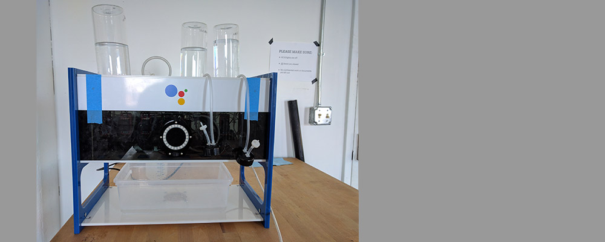

## Google Embedded Assistant SDK: Mocktail Mixer

Make a DIY Robotic Mocktails Mixer Powered by the Google Assistant SDK

[Project Site](http://deeplocal.com/mocktailsmixer/)

### Table of Contents
* [Overview](#overview)
* [Bill of Materials](#bill-of-materials)
* [Mechanical and Electrical Build Instructions](#mechanical-and-electrical-build-instructions)
* [Programming Instructions](#programming-instructions)

**Share your Mixer in the Projects tab.**

---

### Overview

#### Summary

The Google Assistant SDK: Mocktails Mixer not only whips up your favorite mixed drinks at your command, it serves you a side of small talk while you wait.

#### Project Info

* Estimated time to assemble: WIP
* Difficulty: Intermediate
* Cost: $576

#### Features

* Voice-controlled drink ordering (and chitchat!)
* Modular design allows you to customize your Mixer to include as many ingredients and drink combinations as you choose
* A model and Inspiration for other projects that integrate the Google Assistant SDK

#### What You’ll Find
* hardware/ (bill of materials, laser cutting files, CAD files)
* electronics/ (wiring diagrams)
* software/
  * arduino/
  * rpi/
  * gcf/ (google cloud function)
* assets/ (images and other reference assets)

---

### Assistant Bartender Build Instructions

Before you get started, you should have a basic knowledge of soldering. You should also have access to a laser cutter. 

**Step 1** — Gather Your Materials

Tools needed for the build are listed below:
1. Hand drill
2. Rubber mallet or hammer
3. Screwdriver set
4. Exacto knife
5. Soldering Iron
6. Wire cutters
7. Wire strippers

---

### Bill of Materials

[Link to Bill of Materials](assets/bom.pdf)

---

### Cont. Build Instructions

**Main Mixer Body Build**

**Step 1** - Laser Cutting

Laser cut all 2D profiles into the acrylic sheets. See attached drawings for design guidance. (3D CAD files will be available)
<ol type="A">
  <li>Top Panel</li>
  <li>Bottle Capture Panel</li>
  <li>Lid Capture Panel</li>
  <li>Drip Panel</li>
  <li>Pump-Relay Control Panel</li>
  <li>Pour Panel</li>
  <li>Bottom Panel</li>
  <li>Outside  Side Panel</li>
  <li>Inside Side Button Panel</li>
  <li>Outside Side Button Panel</li>
  <li>Front Panel</li>
  <li>Rear Panel</li>
  <li>Cup Indicator Panel</li>
</ol>

**Step 2** - Assemble Bottle Holder Sub Assembly

Attach Top Panel with Bottle Capture Panel together with 10-32 fasteners and 1 inch standoffs See Figure 2 for more detail. (Optional)

---

### Mechanical and Electrical Build Instructions

---

### Programming Instructions
